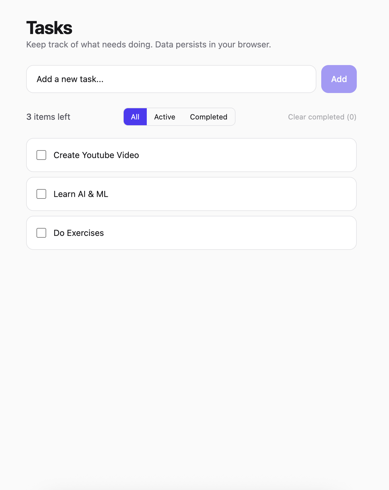
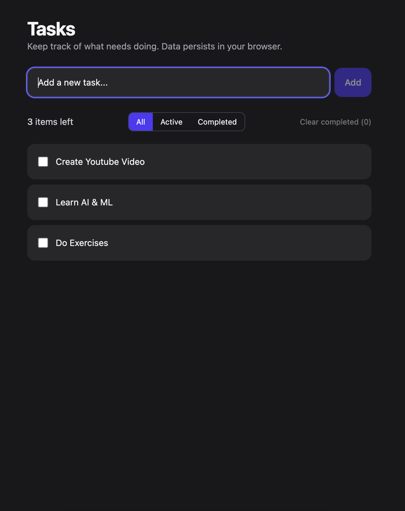

# Angular + NgRx Todo App (Tailwind CSS, LocalStorage)

A clean, modern Todo application built with Angular (standalone), NgRx Store + Entity, and Tailwind CSS. State is persisted to LocalStorage with a production-ready meta-reducer and versioning. The UI is lightweight, responsive, and designed with accessibility and performance in mind.

Badges:
- 
- 
- 
- 

---

## Features

- Modern, responsive UI with Tailwind CSS
- Angular standalone components (no NgModules)
- NgRx Store + Entity for normalized, scalable state
- LocalStorage persistence via meta-reducer with versioning
- Runtime checks enabled for safe, predictable state
- DevTools integration for time-travel debugging
- Container/presentational component split
- Filters (All, Active, Completed), counts, and Clear Completed
- Inline editing, keyboard-friendly (Enter = save, Esc = cancel)
- Performance friendly: OnPush change detection + trackBy

---

## Quick Start

Prerequisites:
- Node.js 18+ (LTS recommended)
- npm 9+ (or use pnpm/yarn if you prefer)

Steps:
1) Clone the repo
   - git clone https://github.com/your-org/todo-ngrx.git
   - cd todo-ngrx
2) Install dependencies
   - npm install
3) Run the dev server
   - npm start
   - Open http://localhost:4200
4) Production build
   - npm run build
   - Serve the contents of dist/todo-ngrx/ with any static server

Note: State is saved in your browser via LocalStorage. Clearing site data will reset todos.

---

## Tech Stack

- Angular (standalone components + provide* APIs)
- NgRx Store, Entity, Store DevTools
- Tailwind CSS
- TypeScript

---

## Project Structure

- src/
- app/
- core/
- meta-reducers/
- storage-sync.metareducer.ts
- features/
- todos/
- todos.actions.ts
- todos.models.ts
- todos.reducer.ts
- todos.selectors.ts
- todo-item.component.ts
- filter-bar.component.ts
- todos-page.component.ts
- app.component.ts
- app.routes.ts
- main.ts
- styles.css
- tailwind.config.js

## Key components:
- TodosPageComponent: Container that connects to the store, dispatches actions
- TodoItemComponent: Presentational item (toggle, edit, delete)
- FilterBarComponent: Filter buttons, counts, clear completed

---

## Architecture Overview

State management (NgRx):
- EntityAdapter normalizes todos as ids + entities
- Deterministic reducer with small, focused actions:
  - Add, Toggle, Update Title, Remove, Clear Completed
  - Change Filter
- Selectors for:
  - All todos
  - Current filter
  - Active/Completed counts
  - Filtered list (derived)

LocalStorage persistence:
- Meta-reducer (core/meta-reducers/storage-sync.metareducer.ts):
  - Hydrates on app init (INIT, UPDATE)
  - Saves after each action
  - Versioned payload to allow safe future migrations
  - Gracefully handles private mode/quota errors

Runtime checks:
- Strict immutability and serializability checks for actions/state
- Action type uniqueness and zone checks

UI/UX:
- Tailwind-driven styling with a clean card-like design
- OnPush change detection + trackBy for list rendering
- Accessible controls with labels and keyboard handling
- Dark mode class support (dark:) if you add the "dark" class to html

---

## Important Files

- src/main.ts
  - Bootstraps Router, Store, DevTools
  - Registers meta-reducer and runtime checks

- src/app/features/todos/todos.reducer.ts
  - Feature definition with createFeature
  - EntityAdapter for normalized updates and sorting
  - Derived selectors for filtered list and counts

- src/app/core/meta-reducers/storage-sync.metareducer.ts
  - Versioned LocalStorage hydration/persistence

- tailwind.config.js
  - content: ['./src/**/*.{html,ts}']
  - darkMode: 'class' (ready for a theme toggle)

---

## Scripts

- npm start — Run dev server (ng serve)
- npm run build — Production build
- npm test — Run unit tests (if configured in your workspace)
- npm run watch — Optional (add if you prefer a watch build)

Note: Depending on how you generated the project, lint/test tooling may vary. Adjust scripts as needed.

---

## Configuration Notes

- Storage key: todo-ngrx-state (see storage-sync.metareducer.ts)
- State version: bump STATE_VERSION when you change persisted shape; migrate in loadState()
- Sorting: newest first (createdAt desc) in the EntityAdapter’s sortComparer
- Dark mode: add class="dark" to the html element or implement a toggle component

---

## Screenshots

You can drop screenshots in docs/screenshots and reference them here:

- Light mode
  - 
- Dark mode
  - 

---

## Roadmap

- Unit tests for reducers/selectors
- Drag-and-drop reordering (Angular CDK)
- Search and tag filters
- PWA support (offline + installable)
- Dark mode toggle
- IndexedDB via localForage for larger datasets

---

## Troubleshooting

- No data persisting?
  - Ensure your browser allows LocalStorage, and you’re not in privacy modes blocking it.
- App shape changed and old data won’t load?
  - Increment STATE_VERSION and write a small migration in loadState().
  - Or clear local storage for the site and reload.
- DevTools not showing actions?
  - Ensure Redux DevTools are installed and the app is in dev mode.

---

## Contributing

Issues and PRs are welcome!
- Fork the repo, create a feature branch, and open a PR
- Keep commits focused and include context in PR descriptions
- Follow Angular and NgRx best practices (OnPush, pure selectors, small actions)

---

## License

MIT © PI Softwares
EOF
